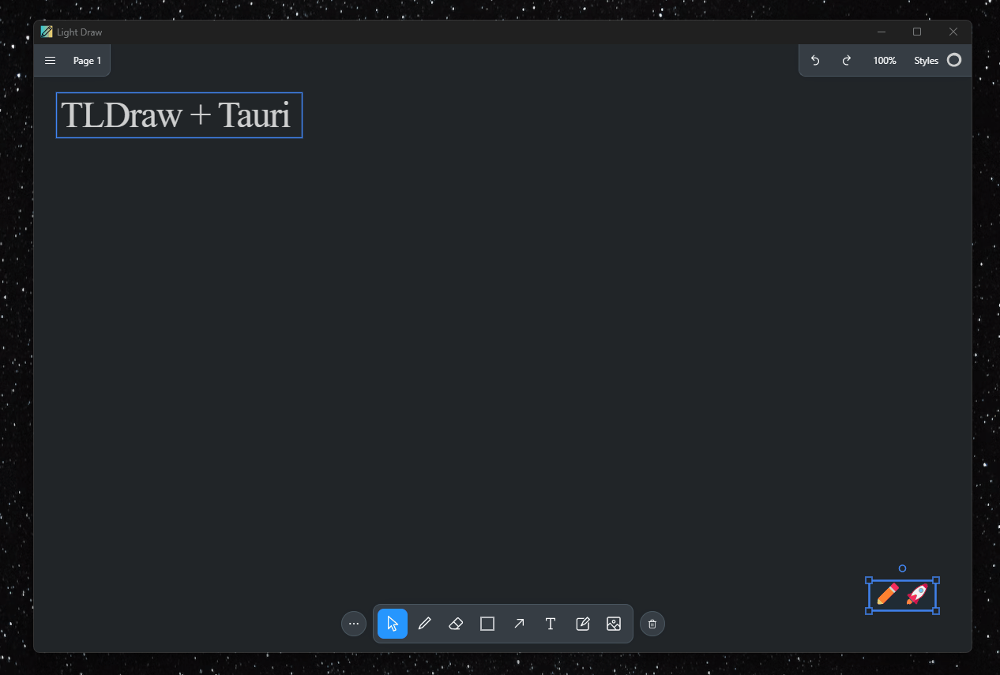

  

<h1 align="center">Light Draw</h1>

A simple drawing app built with TLDraw and Tauri

  <a href="https://github.com/dubisdev/lightdraw/releases/latest">
    🔗 Go to Download Page
  </a>
    &nbsp; | &nbsp; Give it a Star ⭐ | &nbsp;
    <a href="https://www.buymeacoffee.com/dubisdev">Support the project 🤝</a>
    &nbsp; | &nbsp;
    <a href="https://twitter.com/intent/tweet?text=I%27m%20using%20%23LightDraw%20-%20a%20simple%20drawing%20app%20by%20%40dubisdev%0A%0Ahttps%3A%2F%2Fgithub.com%2Fdubisdev%2Flightdraw">
      Share it on Twitter 🐦
    </a>

## 🚀 Features

- ✏️ Offline support for [TLDraw editor](https://tldraw.com/)
- 🌓 Dark and Light themes
- 🚀 Blazing fast

  

## ⚖️ License

MIT © [David Jimenez](https://dubis.dev)
